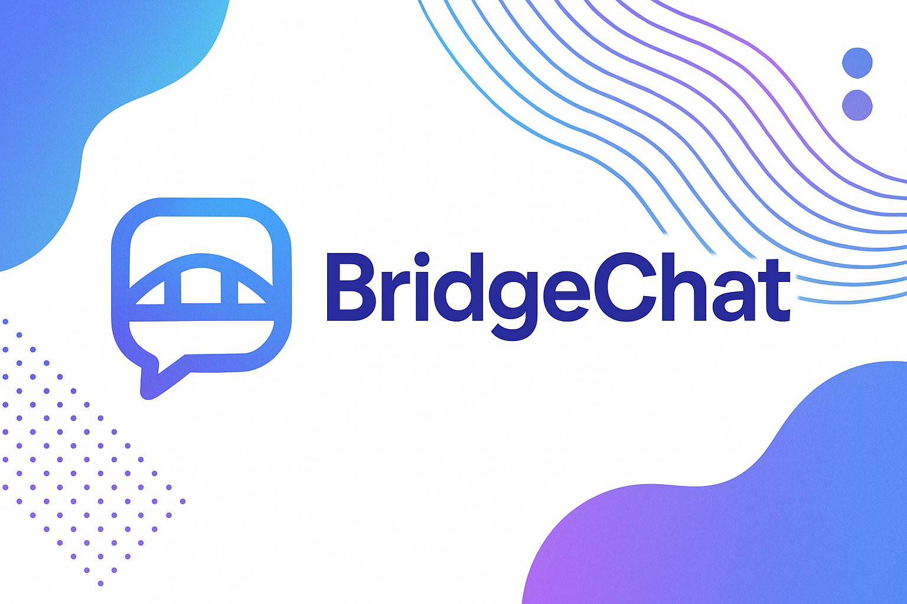

# BridgeChat

<p align="left">
  
</p>
<!--toc:start-->

- [BridgeChat](#bridgechat)
    - [Features](#features)
    - [Tech Stack](#tech-stack)
    - [Getting Started](#getting-started)
        - [Prerequisites](#prerequisites)
        - [Installation](#installation)
    - [🔐 Local Secrets Setup](#🔐-local-secrets-setup)
    - [Documentation](#documentation)
    - [Contributing](#contributing)
    - [License](#license)
    - [Changelog](#changelog)
    - [Contact](#contact)
          <!--toc:end-->

BridgeChat is a real-time chat application designed to break language barriers by integrating real-time translation. It offers seamless communication for users across different languages and platforms—starting with a web interface and expanding to mobile and desktop.

## Features

- **Real-Time Messaging:** Fast, reliable message delivery with instant updates.
- **Group Chats:** Start conversations with multiple users, auto-generate group names, and customize group settings with group names and participant lists.
- **Automatic Translation:** Messages are translated on-the-fly into each participant’s preferred language in both individual and group chats.
- **User Privacy:** Secure, username-based registration without the need for phone numbers.
- **Scalability:** Built using Flutter and Firebase for cross-platform support (web, mobile, desktop).
- **Polished UI:** Gradient backgrounds, responsive layouts, message timestamps, and day-grouped messages for a modern chat experience.

## Tech Stack

- **Front-End:** Flutter (for Web, Mobile, and Desktop)
- **Back-End:** Firebase (Authentication, Firestore/Realtime Database, Cloud Functions, Hosting)
- **Real-Time Communication:** Firebase’s real-time updates
- **Translation Integration:** External translation via Self-Hosted Libretranslate calls.

## Getting Started

### Prerequisites

- Flutter SDK installed on your machine
- A Firebase project with Authentication, Firestore/Realtime Database, Cloud Functions, and Hosting enabled
- API key/configuration for your translation service (if applicable)

### Installation

1. **Clone the repository:**

    ```bash
    git clone https://github.com/av1155/bridgechat.git
    ```

2. **Navigate to the project directory:**

    ```bash
    cd BridgeChat
    ```

3. **Install dependencies:**

    ```bash
    flutter pub get
    ```

4. **Configure Firebase:**

- Update your Firebase configuration (e.g., `firebase_options.dart`) with your project details.

5. **Run the app:**

    ```bash
    flutter run
    ```

    > 💡 Tip: For web builds, you can use `flutter run -d chrome` or `flutter build web` to test and deploy.

## 🔐 Local Secrets Setup

To run locally:

1. Copy `lib/secrets_sample.dart` to `lib/secrets.dart`
2. Fill in your actual translation API URL
3. Make sure `lib/secrets.dart` is not committed (already in `.gitignore`)

## Documentation

Detailed project documentation is available in the [BridgeChat_Docs](./BridgeChat_Docs) folder:

- [Project Vision](./BridgeChat_Docs/1-Project_Vision.md)
- [SRS](./BridgeChat_Docs/2-SRS.md)
- [System Architecture](./BridgeChat_Docs/3-System_Architecture.md)
- [Project Plan & Roadmap](./BridgeChat_Docs/4-Project_Plan_Roadmap.md)
- [Testing & Quality Assurance](./BridgeChat_Docs/5-Testing_Quality_Assurance.md)
- [Deployment & Maintenance](./BridgeChat_Docs/6-Deployment_Maintenance.md)
- [Developer Documentation](./BridgeChat_Docs/7-Developer_Documentation.md)

## Contributing

Contributions are welcome! Please open an issue or submit a pull request with improvements or bug fixes.

## License

This project is licensed under the MIT License. See [LICENSE.md](./LICENSE.md) for details.

## Changelog

See [CHANGELOG.md](./CHANGELOG.md) for a history of changes and version updates.

## Contact

For inquiries, please contact [contact@andreaventi.com](mailto:contact@andreaventi.com).
